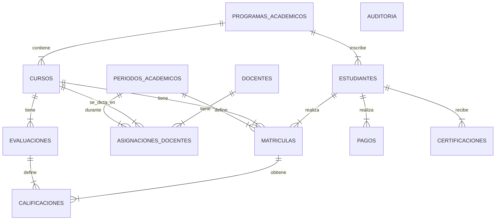

## 1. Descripción del Modelo
El modelo relacional diseñado satisface las necesidades de gestión académica integral.
- **Normalización**: Todas las tablas están en 3FN.
- **Entidades Clave**: Estudiantes, Docentes, Cursos, Programas, Periodos.
- **Relaciones**:
  - Un estudiante pertenece a un programa.
  - Una matrícula vincula estudiante, curso y periodo.
  - Las calificaciones se asignan a una matrícula específica y una evaluación definida.

### Diagrama ER


## 2. Scripts SQL Implementados

Todos los scripts se encuentran en la carpeta `EduTechPlus`. A continuación se presenta un resumen de su contenido:

### 2.1 Esquema (`01_schema.sql`)
Define las tablas con sus tipos de datos, claves primarias (`SERIAL`), claves foráneas y restricciones `CHECK` para garantizar la integridad de los datos.
- **Tablas**: `programas_academicos`, `docentes`, `estudiantes`, `periodos_academicos`, `cursos`, `asignaciones_docentes`, `matriculas`, `evaluaciones`, `calificaciones`, `pagos`, `certificaciones`, `auditoria`.

### 2.2 Procedimientos Almacenados (`02_procedures.sql`)
Encapsulan la lógica de negocio compleja usando PL/pgSQL.
- `registrar_estudiante`: Valida duplicados y existencia de programas.
- `matricular_estudiante`: Verifica cupos, estado del estudiante y duplicidad de matrícula.
- `registrar_calificacion`: Realiza un "Upsert" (Insertar o Actualizar) y valida rangos (0.0 - 5.0).
- `calcular_promedio_estudiante`: Calcula el promedio ponderado de notas.
- `generar_certificacion`: Emite certificados solo si el estudiante tiene aprobaciones.

### 2.3 Triggers (`03_triggers.sql`)
Automatizan tareas críticas de validación y auditoría.
- `auditar_matricula_func`: Registra cualquier cambio (INSERT, UPDATE, DELETE) en la tabla `matriculas` hacia la tabla `auditoria`.
- `validar_calificacion_func`: Previene la inserción de notas fuera de rango a nivel de base de datos.
- `auditar_pago_func`: Registra automáticamente los pagos recibidos.

### 2.4 Vistas (`04_views.sql`)
Facilitan la consulta de información frecuente.
- `vista_estudiantes_programa`: Listado simple de estudiantes.
- `vista_cursos_docentes`: Relación de carga académica.
- `vista_historial_academico`: Detalle completo de notas y cursos por estudiante.
- `vista_resumen_pagos`: Totalizado de pagos por estudiante y periodo.

### 2.5 Consultas Complejas (`05_queries.sql`)
10 consultas avanzadas que resuelven preguntas de negocio utilizando:
- **CTEs (Common Table Expressions)** para cálculos intermedios (ej. promedios históricos).
- **Subconsultas** y **Joins múltiples**.
- **Case When** para clasificación de estudiantes.
- **Funciones de Ventana/Agregación**.

### 2.6 Datos de Prueba (`06_seed.sql`)
Inserta datos realistas para poblar todas las tablas y permitir la ejecución inmediata de pruebas.

## 3. Instrucciones de Ejecución
Para desplegar esta base de datos en un servidor PostgreSQL:

1. Crear una base de datos vacía: `CREATE DATABASE db_diego_zuluaga;`
2. Conectarse a la base de datos.
3. Ejecutar los scripts en orden secuencial:
   ```sql
   \i 01_schema.sql
   \i 02_procedures.sql
   \i 03_triggers.sql
   \i 04_views.sql
   \i 05_seed.sql -- (Opcional, para datos de prueba)
   \i 05_queries.sql -- (Para verificar las consultas)
   ```
